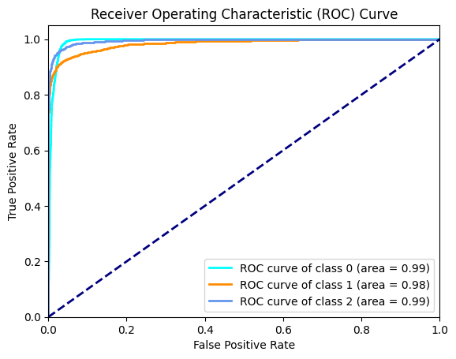
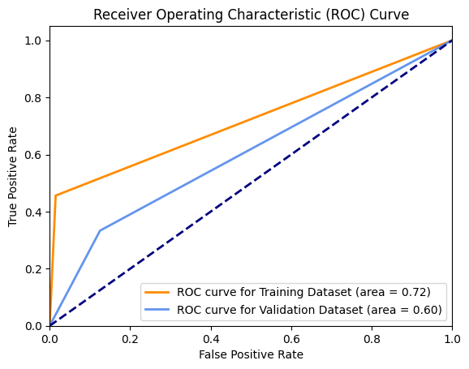

# DeepLense_SSL

This repository contains the solution of the evaluation tasks of the project "Learning Representation Through Self-Supervised Learning on Real Gravitational Lensing Images" in Google Summer of Code 2024 under Machine Learning for Science (ML4Sci). 

## Approach

### Common Task

I have used a ResNext50 model for image classification purposes. The following training configuration was used:

```
Epochs = 17
Batch Size = 32
Loss Function = Cross Entropy Loss
Optimizer = AdamW with LR=0.001
Scheduler = Reduce LR on Plateau with Factor=0.1, Patience=2
Early Stopping with Threshold=4
```

### Specific Task 6: Semi-Supervised Learning on Real Strong Lensing Images

I have used SimCLR as the Semi-Supervised Pipeline. I defined a class for data-relevant SimCLR transformations, including random crop, horizontal flipping, colour jittering, and Gaussian blurring. 

For the given dataset, I performed a stratified split of 90% Training and 10% Validation. I have used a pre-trained ResNet-18 as the backbone for the SimCLR pipeline due to the shortage of data. In case of a bigger dataset, we can set the pre-trained flag in the model flag as false and perform pre-training ourselves.

I have used a projection head to convert the feature map into a 128-dimensional encoding of the image.

Initial training showed NaN values as the value of loss. This was due to the values of some pixels in the images being NaN. On performing EDA, it was concluded that the lensing images with lenses had 0.194% of pixels with NaN values per image, and those without lenses had 0.125% of pixels with NaN values per image. Since the percentage of NaN pixels per image was very low, I have replaced them with 0. 

I trained the SimCLR pipeline on the training dataset with the following configuration

```
Epochs = 15
Batch Size = 128
Loss Function = NTXent Loss
Optimizer = LARS with base optimizer as AdamW with LR=0.001
Scheduler = Reduce LR on Plateau with Factor=0.1, Patience=2
Early Stopping with Threshold=4
```

After training the pipeline, I obtained the encodings for both the training and validation dataset in the form of a NumPy array. Then I trained a logistic regression on the training dataset encodings with OLS (sklearn). Then, I obtained the predictions on the validation dataset.


## Directory Structure

```
Root directory
├── dataset
│	├── train
│	├── val
├── images
│	├── ROC-AUC_CommonTask.png
│	├── ROC-AUC_SpecificTask6.png
├── real_hst
├── task1_models
│	├── best.pth
│	├── README.md
├── task2_models
│	├── best_encoder.pth
│	├── classifier_logreg.pkl
│	├── README.md
├── common_task.ipynb
├── preds_ct.csv
├── README.md
├── requirements.txt
├── roc_auc_results_task1.csv
└── specific_task6.ipynb
```
## Installation and Replication

Clone this repository and run the following commands on the terminal:

```bash
  git clone "https://github.com/ShrenzyPanda/DeepLense_SSL.git"
  cd DeepLense_SSL
  pip install -r requirements.txt
```
For the replication of results obtained:-
 1. Clone this repository.
 2. Open the cloned directory.
 3. Open the terminal and execute "pip install -r requirements.txt"
 4. Ensure that you extract the common dataset and task 6 dataset in this directory itself. Please look at the directory structure above to ensure files are placed correctly.
 5. Open the folders "task1_models" and "task2_models" and download the models from the given drive link. The drive links are present in the REAMDE.md file in the folders.
 6. The Jupyter Notebook named "common_task.ipynb" corresponds to the common task, and the one called "specific_task6.ipynb" corresponds to the specific task 6.
 7. Open the notebooks and run them. The notebook is filled with comments for explaining the approach. NOTE: If you want to perform inference only, you can skip the cells corresponding to training loops (mentioned in the notebook as well).

The drive link for the models and dataset zip files is given below:-

https://drive.google.com/drive/folders/1TPOi9csL53reiHre1ejHPUkjgni2NwOY?usp=sharing

NOTE: The links for models in their directory and the one given here are the same.
## Results

On the common task, I obtained the following ROC-AUC Scores in the one v/s all regime:

No Substructure: 0.9922
Sphere Substructure: 0.9844
Vortex Substructure: 0.9948



The Macro ROC-AUC Score obtained was 0.9904

On specific task 6, i.e. Semi-Supervised Learning on Real Strong Lensing Images, I obtained the following ROC-AUC Scores on the training and validation datasets:

Training: 0.7207
Validation: 0.6042


